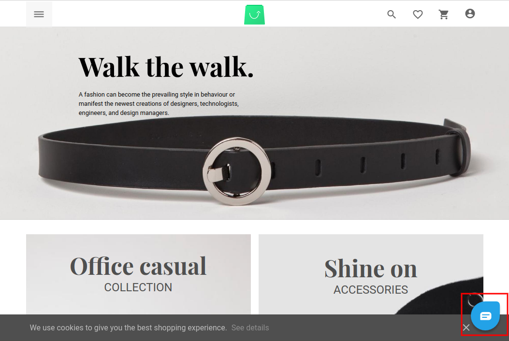

# Vue Storefront Freshchat module
[Freshchat](https://www.freshworks.com/live-chat-software/) integration for [vue-storefront](https://github.com/aureatelabs/vsf-freshchat), by [Aureate Labs](https://aureatelabs.com/)
> This module helps you engage and delight your customers wherever they are - web, mobile and social messengers.

**Note:** Freschat registration required to use this module into your vue-storefront website. and This module is tested with the Vue storefront version 1.11

Freshchat helps you engage and delight your customers wherever they are - web, mobile and social messengers.
There are several useful features with freshchat
- Reach out wherever they are
- Automate with bots and AI
- Engage with proactive campaigns
- For more feature visit [freshchat](https://www.freshworks.com/live-chat-software/features)



Freshchat documentation: https://developers.freshchat.com/

## Installation:

### 1. Clone the repository

Clone the vsf-freshchat repository into your VSF installation.
```shell
$ git clone git@github.com:aureatelabs/vsf-freshchat.git vue-storefront/src/modules/freshchat
```
### 2. Add the extension config to your local VSF configuration file.
Add the following JSON config snippet into your desired config, eg. `config/local.json`
```json
"freshchat" : {
  "token" : "<YOUR_FRESHCHAT_TOKEN>",
  "host": "<YOUR_FRESHCHAT_HOST>"
}
```
Replace the `YOUR_FRESHCHAT_TOKEN` & `YOUR_FRESHCHAT_HOST` parameter with the freshchat token & freshchat host provided by Freshchat after registration. You can find your token & host after login to your freshchat account.


Valid token example: `"token": "dc5a7a7c-cfdd-43ae-9283-5ebb61beeeb6"`
Valid host example: `"host": "https://wchat.freshchat.com"`
### 3. Register the Freshchat module
Open up your `../vue-storefront/src/modules/client.ts` and add the following code. Adding it inside this file the registers the extension so it can be used in your Vue Storefront.
```js
  ...
	import { Freshchat } from './freshchat'  /* This is the module name which is we are creating */
	import { registerModule } from '@vue-storefront/core/lib/modules'

	export function registerNewModules () {
		...
		registerModule(Freshchat) /* Register created module which we created in this tutorial */
	}
```
### 4. Enjoy!
Thats it! It's easy, plug and play! If you haven't got an Freshchat already, you can create one here, there is free tier that you can use to get started: https://www.freshworks.com/live-chat-software/signup/

## Customization

### Replacing the Freshchat Script.
If you need to change the Freshchat script that is loaded on the page, open up the `./freshchat/index.ts` file. On the freshchatSnippet function. you'll find the script provided from Freshchat, you can swap this out or extend it as required.

## License
This project is licensed under the [MIT License](https://github.com/aureatelabs/vsf-freshchat/blob/master/LICENSE)
